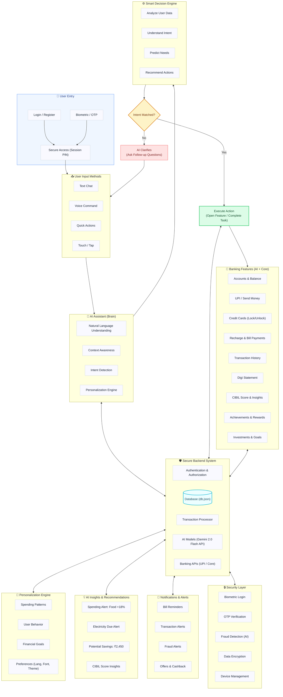

# Zenith - AI-Powered Hyper-Personalized Secure Banking App ✨

Welcome to **Zenith**, a premium, secure, and hyperpersonalized banking dashboard designed to give users complete control over their financial wealth and security. 

Zenith is built on a modern **React + Vite** frontend and a stateful, modular **Node.js + Express** backend, serving simulated mock banking operations backed by a local JSON file database (`db.json`) for data persistence. The system leverages the **Google Gemini API** for natural language understanding and real-time execution flows.

---

## 📊 Architectural Workflow Flowchart

The diagram below represents the end-to-end user interaction flow, AI decision logic, and backend security orchestration that powers Zenith:



---

## 🔄 Step-by-Step Interactive Workflow

The interaction cycle flows sequentially to guarantee user intent is verified and secure operations are conducted:

1. **Secure Onboarding/Entry**: The user accesses the app securely via credentials combined with simulated **Biometric / OTP validation**.
2. **Multimodal Input Capture**: Users interact using **Text Chat**, **Voice commands**, **Touch/Tap gestures**, or **Quick Actions**.
3. **AI Interpretation**: The **AI Assistant (Brain)** analyzes inputs via Natural Language Understanding (NLU), identifying matching context and intent.
4. **Smart Intent Evaluation**:
   - **Intent Unclear**: If the target intent is ambiguous, the system prompts follow-up questions to resolve the ambiguity.
   - **Intent Matched**: Once verified, the intent triggers a transaction or UI action.
5. **Execution**: The app executes the action (e.g., initiating a UPI transfer, toggling a credit card lock state, or paying a bill) while integrating with the secure backend systems.

### 🎙️ Example Voice / Text Flow
```
User: "Send ₹500 to Rahul"
  └── AI: "Are you sure you want to send ₹500 to Rahul?" (Context Check & Confirmation)
       └── User: "Yes"
            └── AI: "Please enter your UPI PIN" (Security Challenge)
                 └── AI: "Transfer Successful! ✅" (Execution & Database Commit)
```

---

## 🛠️ Tech Stack & Infrastructure

- **Frontend**: React 19, Vite, Vanilla CSS (using modern HSL palettes, glassmorphism, responsive grid layouts).
- **Backend**: Node.js, Express.js, CORS, Body-Parser.
- **Database**: Local JSON storage (`db.json`) with auto-seeding. Handles balances, cards, loans, active policies, budgets, and security audit logs.
- **Proxy Routing**: Vite is configured to proxy all `/api/*` traffic automatically to the Express server running on port 5000.

---

## 🧩 Backend Services & Engines Deep-Dive

Zenith features a modular backend composed of 8 specialized engines:

1. **AI Service (`aiService.cjs`)**: Connects to the **Google Gemini API** (`gemini-2.0-flash`) with automatic retries and exponential backoff. It translates unstructured user text/voice input into actionable structured intents.
2. **Personalization Engine (`personalizationEngine.cjs`)**: Dynamically rearranges the dashboard widget layout. For example, if there is a credit card utilization spike or a bill due in under 3 days, it overrides normal settings to place those alerts front and center.
3. **Fraud Detection Engine (`fraudDetection.cjs`)**: Inspects transactions in real-time. Automatically blocks transactions over custom limits, disables unauthorized international swipes, flags transfers above ₹150,000 as high-risk, and locks compromised cards instantly.
4. **Analytics Engine (`analyticsEngine.cjs`)**: Evaluates the user's financial health score (0-100) based on savings ratio, credit card utilization, budget adherence, and bill status. It maps this score to a standard **CIBIL Score (300-850)** and serves personalized financial advice.
5. **Notification Service (`notificationService.cjs`)**: Generates real-time personalized notifications, including low balance warnings, pending bills, upcoming EMI reminders, large expense alerts, and pre-approved offers.
6. **Recommendation Engine (`recommendationEngine.cjs`)**: Offers customized products based on financial data (e.g., High Fixed-Deposit interest offers for users with high balances, or pre-approved loans for users with high CIBIL scores).
7. **Transaction Service (`transactionService.cjs`)**: Orchestrates core financial ledger operations, balance updating, bill payments, and historical records.
8. **Auth Service (`authService.cjs`)**: Validates transaction PINs, OTP codes, and creates real-time security audit logs for all mutations.

---

## 🛡️ Security Simulator Features

1. **Two-Factor Authentication (2FA)**: Money transfers require double validation (Transaction PIN first, followed by a simulated SMS OTP) before releasing savings.
2. **Inactivity Session Lock**: The app monitors user activity. After 5 minutes of idle time, a 30-second warning countdown modal is shown. If unanswered, the session locks and encrypts, requiring the Transaction PIN to resume.
3. **Card CVV Reveal**: Full credit card numbers and CVVs are masked with asterisks. Clicking "Show Card Details" requires PIN authorization and starts a 15-second visual countdown before auto-masking.
4. **Security Audit Log**: Every database mutation (transfers, paid bills, limits adjusted, card frozen, profile updates) triggers a backend security log entry, viewable dynamically under the *Settings & Security* tab.

---

## 🔑 Demo Credentials

To test the security flows, use the following simulated credentials:
* **Transaction PIN**: `1234`
* **SMS OTP Code**: `123456`

---

## 🚀 Getting Started & Local Setup

Follow these steps to launch and explore the project locally:

### 1. Install Dependencies
Run the command below in the project directory to install React, Vite, Express, and CORS:
```bash
npm install
```

### 2. Start the Backend API
Start the Express server on port 5000:
```bash
node server.cjs
```
*(On startup, it will seed `db.json` automatically if it doesn't already exist).*

### 3. Start the Frontend
Launch the Vite React application:
```bash
npm run dev
```
Open **[http://localhost:5173/](http://localhost:5173/)** in your web browser.

---

## 📋 Interactive Verification Checklist

To experience the full functionality of the Zenith App, perform these tests:
- [ ] **Dashboard**: Click the eye icon on the Total Balance card. Verify that the balance masks to `₹ *,**,***.**` and unmasks on second click.
- [ ] **Pay a Bill**: Under *Upcoming Payments*, click **Pay** next to the Credit Card Bill (₹8,750). Authorize it, and verify that the savings balance declines and the bill is removed.
- [ ] **Send Money**: Navigate to the *Payments* page, fill out the form (e.g. transfer ₹5,000 to Priya), enter PIN `1234`, and enter OTP `123456`. Verify the receipt.
- [ ] **Adjust Limits**: Navigate to the *Cards* page, slide the *Online Transactions* range slider, and click **Save Custom Limits**.
- [ ] **Check Audit Log**: Navigate to the *Settings* page and scroll to the *Security Activity Log*. Verify that every transaction, card action, and limits change is logged in real-time.
